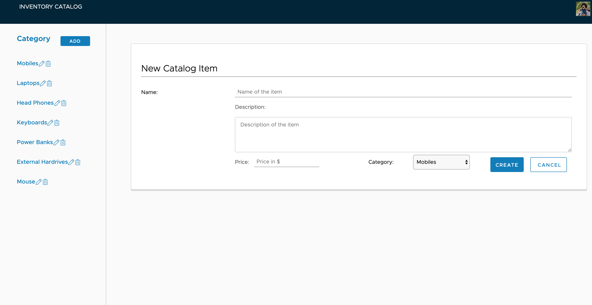

# Item Catalog

## About

This project showcases CRUD operations with OAUTH2 Authentication. VMware Clarity project is used for layout and creating UI of the application. User logs in using his google account. User can perform CRUD operations. Both Authentication and Authorization is implemented. Database used is SQLLite and ORM used is SQLAlchemy. There are also JSON endpoints exposed for other devices integration. As mentioned in helful resourses help is been taken from udacity ud330 and auth2.0 project

## System setup and how to view this project
This project makes use of Udacity's Linux-based virtual machine (VM) configuration which includes all of the necessary software to run the application.
1. Download [Vagrant](https://www.vagrantup.com/) and install.
2. Download [Virtual Box](https://www.virtualbox.org/) and install.
3. Use Github to fork and clone, or download, the repository https://github.com/udacity/fullstack-nanodegree-vm.

You will end up with a new directory containing the VM files. Change to this directory in your terminal with cd. Inside, you will find another directory called vagrant. Change directory to the vagrant directory:

#### Run these commands from the terminal in the folder where your vagrant is installed in:
1. ```cd /vagrant``` to change to your vagrant directory.
2. ```vagrant up``` to start up the VM.
3.  ```vagrant ssh``` to log into the VM.
4. ```pip3 install SQLAlchemy```
5. ```python3 database_setup.py``` for database setup.
6. ```pip3 install Flask```
7. ```pip3 install httplib2```
8. ```pip3 install oauth2client```

## JSON Endpoints

`/api/v1/catalog.json` - Returns JSON of all items in catalog
`/api/v1/categories/<int:category_id>/item/<int:catalog_item_id>/JSON` - Returns JSON of selected item in catalog
`/api/v1/categories/JSON` - Returns JSON of all categories in catalog

## Screen Shots





## Helpful Resources
* [PEP 8 -- Style Guide for Python Code](https://www.python.org/dev/peps/pep-0008/)
* [PostgreSQL 9.5 Documentation](https://www.postgresql.org/docs/9.5/static/index.html)
* [Vagrant](https://www.vagrantup.com/downloads)
* [VirtualBox](https://www.virtualbox.org/wiki/Downloads)
* https://github.com/udacity/ud330
* https://github.com/udacity/OAuth2.0


## Authors

* **Saumyaraj Zala** - *Individual work* - [saumyaraj](https://github.com/saumyaraj)
